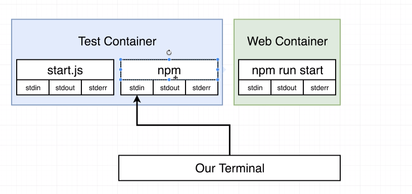
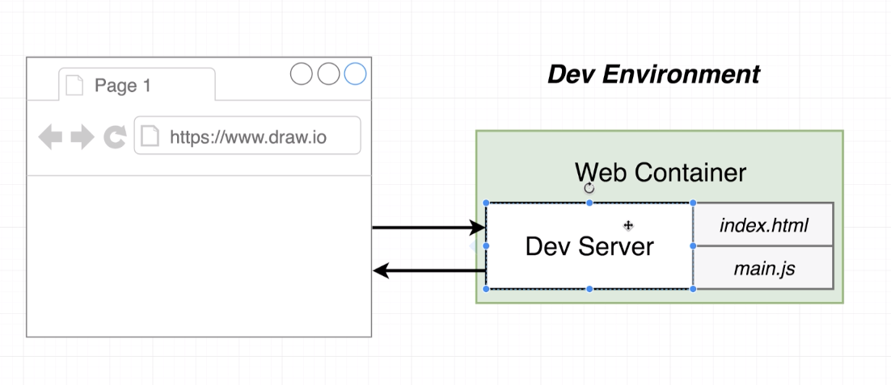
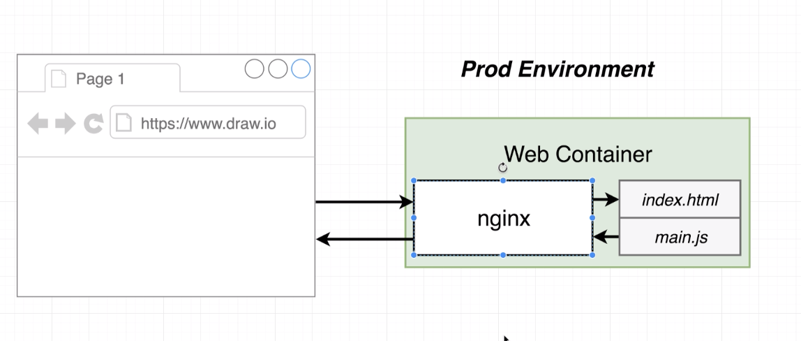
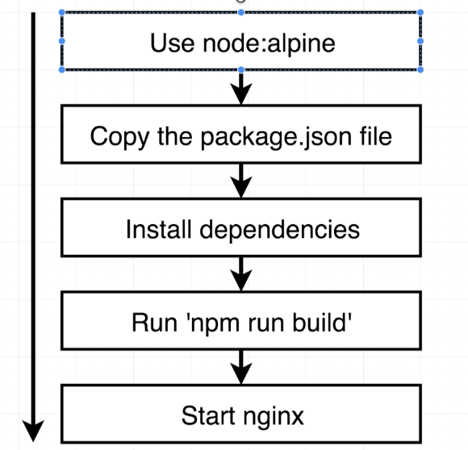
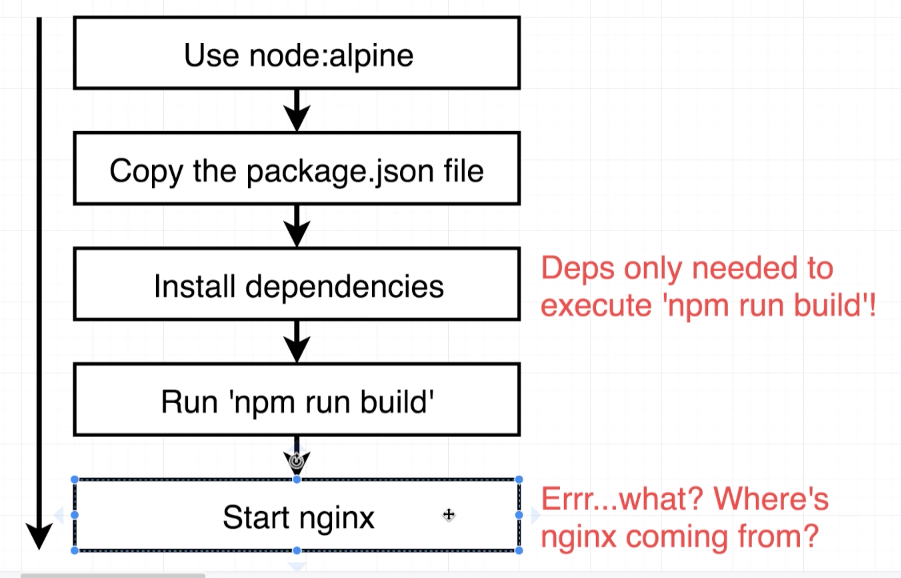
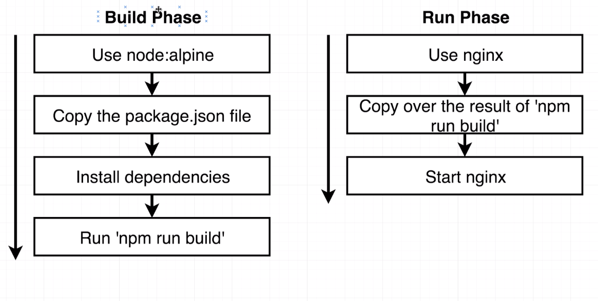

# Frontend for production-grade docker demo

## Instructions
• Using `Dockerfile.dev` for development startup    
• Run `docker build -f Dockerfile.dev .` in the directory to build the image    
• Run `docker run -it -p 3000:3000 CONTAINER_ID`    

This runs into an issue where updated code won't be reflected in the running container since the docker build takes a snapshot of the source code.
In order to have a straight copy, we need a different flow using `Docker volume`

### Docker Volumes

Instead of this:
```
Local Folder
  - frontend
  - /src
  - /public
```

Being copied over as 

```
Docker Container
  - /app
    - /src
    - /public
```

We will use it as:
```
Docker Container
  - /app
    - /src (references /src in local folder)
    - /public (references /public in local folder)
```

So we are essentially mapping references to the files. Sometimes the docker volumes are harder to setup, so we don't do this with simpler projects.

The essential "formula" for the docker volume command is:
`docker run -it -p 3000:3000 -v /app/node_modules -v $(pwd):/app <image_id>`    
• `-v /app/node_modules`: put a bookmark on the `node_modules` folder      
• `-v $(pwd):/app`: map the `pwd` into the `/app` folder      

If you try to run `docker run -it -p 3000:3000 -v $(pwd):/app <image_id>`, it will not work if you do not have `node_modules` directory locally. This is because `$(pwd)` is the current local working directory is the being referenced by what's on the right-hand side of `:`, which is `/app`: 

```
Docker Container
  - /app
    - /src (references /src in local folder)
    - /public (references /public in local folder)
    - /node_modules (references /node_modules in local folder) // THIS DOESN'T EXIST IN LOCAL FOLDER, SO HAS A NULL REFERENCE
```
So if you don't have `node_modules` locally, then you must add `-v /app/node_modules` as part of the command. This is saying that specific directory structure in the container should not be referencing anything in the local directory.

### Using docker-compose file for docker volumes
See `/docker-compose.yml` file for example.    
An update to `cra` leads to application exiting with code 0. Add stdin_open property to your docker-compose.yml file:
```
  web:
    stdin_open: true
```
Make sure you rebuild your containers after making this change with  docker-compose down && docker-compose up --build

https://github.com/facebook/create-react-app/issues/8688    
https://stackoverflow.com/questions/60790696/react-scripts-start-exiting-in-docker-foreground-cmd    

### Using dockerfile in docker-compose.yml
In our `Dockerfile.dev`, we have a command to copy everything in the pwd over to the docker image instance. But since we are using docker volumes and referencing directories from the container to the local folder (except `node_modules`), we don't need the copy command in the `Dockerfile.dev` file.

But, it's still worth having it because:
1. It reminds the devops to copy over the folders if `docker-compose.yml` is no longer being used
2. No more changes are needed in the pwd, especially if it's on production

## Running tests
We have an script command `test` that will execute tests. To do this manually, we can do the following:
1. Build container - `docker build -f Dockerfile.dev .`
2. Run container - `docker run -it containerId npm run test`

By doing so, we can see the tests running. But we can't update tests and expect the container to know about these changes since it's a snapshot of the code when we built it.

So, we need to run the following:
1. Build, create, and start and attach container to service - `docker-compose up`
2. Enter the running container and execute test command = `docker exec -it containerId npm run test`

At this point, any changes to tests will automatically update. But there is a better way to do this using the `docker-compose.yml` file

We updated the `docker-compose.yml` file to include a new service:
```
 tests:
    build:
      context: .
      dockerfile: Dockerfile.dev
    volumes:
      - /app/node_modules
      - .:/app
    command: ["npm", "run", "test"]
```

We are using the same dockerfile and same volumes, except the command is different. Now we can run `docker-compose up --build` (`--build` just to ensure everything is built properly, a good thing to do when defining a new service to the yml file). At this point, we should have the app service running and accessible, as well as the test. And the tests can be live updated as well.

The fallback behind using docker-compose is that while we can have updated tests, we can't enter in shell commands for the test prompts (like watch, run failed tests only, etc). This is because:

1. `npm` is the first process running in the container. This has file handles such as `stdin`, `stout`, and `sterr`. When we use docker-compose to build and start the containers, the first process is the `npm`. Then the `npm` looks at the command prompt, and it runs `test`, which is a second, completely new process that runs in the container.
2. Unfortunately, docker only maps the shell commands that we enter into the terminal to the file handles of the first process, which is `npm`. It cannot map to the second process, `test`, which has its own file handles, but it has no way of listening to what we actually enter into the terminal. We can test this by running `docker attach containerId` and trying to execute commands. See this image: 

## Production Environment
We need a different `Dockerfile` for production environment. We don't want to run a dev server in production because the server takes a lot of processing power to reflect updates to code. There are no updates on prod, so we need to use a web server that handles incoming traffic and responds with appropriate static files. We can use nginx for this web server.

1. Dev environment: 
2. Prod environment: 

Production process: 

But there is a problem with this process... 

Once deps are built, we don't need to install these deps. Also, we need to configure nginx so it has that web server in the container. 

But, we need to install the nginx base image - yet we are already using `node:alpine` image. So we need to figure out a way to do install 2 base images: 


### Multi-step build process
See `Dockerfile` for example. The differences from `Dockerfile.dev`:

1. The first base image `FROM node:alpine` now has a tag: `as builder`
2. We are copying over everything that was built from the first phase on to the 2nd base image. The `--from=` indicates we want to copy over something from a different docker phase: `COPY --from=builder /app/build /usr/share/nginx/html`
3. The `/usr/share/nginx/html` is just the directory location that nginx has configured to place static files in.
4. The `Start nginx` step is not required in the `Dockerfile` because the docker nginx container by default will start up nginx.

Now that we defined our `Dockerfile`, we can test the prod process:
1. Build container: `docker build .` (no `-f` needed to specify file since we're using default `Dockerfile` file)
2. Once built, run the container: `docker run -it -p 8080:80 containerId`
• Port 80 is the default port for nginx, so that's what we map it to


# Continuous Integration and Deployment using AWS